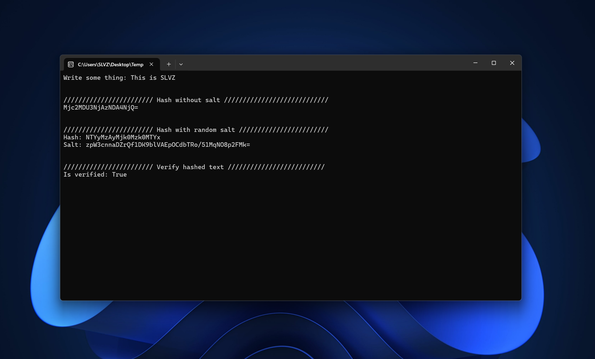

# SimpleHash



**SimpleHash** is a lightweight and easy-to-use hashing utility written in C#. It provides basic but custom hashing functionality designed for educational use or lightweight scenarios.

---

## 🔐 Features

- ✔️ Hash plain text strings to a fixed-length Base64 string  
- 🔀 Supports both random and custom salts  
- 🔁 Compare input text with a hashed version for verification  
- 🚫 Resistant to basic collisions  
- 🧠 Sensitive to character order – even minor changes yield different outputs  
- 📏 Produces consistent-length Base64 output

---

## 🚀 How It Works

Internally, SimpleHash uses a custom hashing algorithm based on character codes and arithmetic operations. You can hash values with or without a salt:

### Hash without salt

```csharp
var hasher = new SimpleHash.SimpleHash();
string hash = hasher.Hash("password123");
```
---

### Hash with radnom salt

```csharp
var hasher = new SimpleHash.SimpleHash();
string salt;
string hash = hasher.Hash("password123", out salt);
```
---

### Hash with custom salt

```csharp
string salt = "yourCustomSalt==";
string hash = hasher.Hash("password123", salt);
```markdown
---

### Verify a hash without salt

```csharp
bool isValid = hasher.Verify("password123", hash);
```
---

### Verify a hash with salt

```csharp
bool isValid = hasher.Verify("password123", hash, salt);
```
---

### Salt Generation

```csharp
string salt = hasher.CreateRandomSalt(); // Default is 32 bytes, max 64
```
---


## Links

- [Website](https://slvz.dev)


